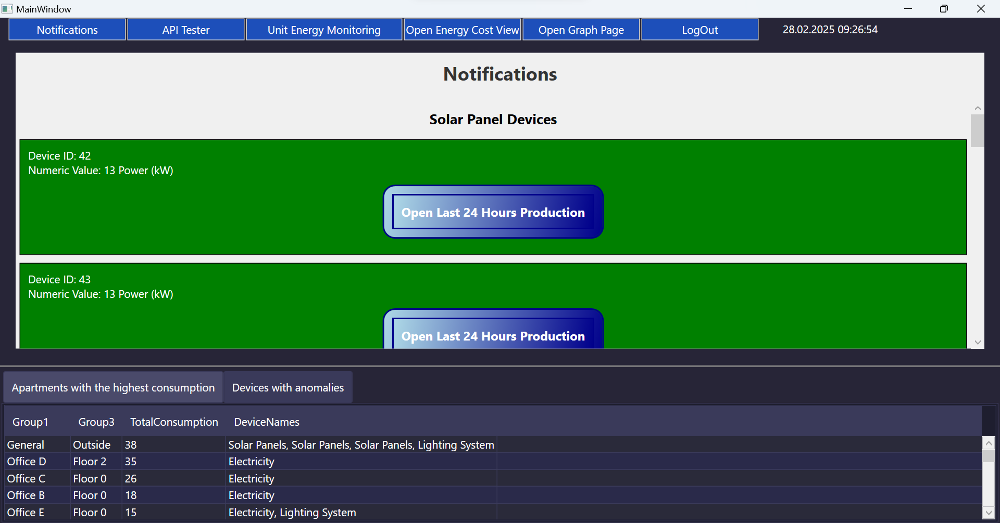
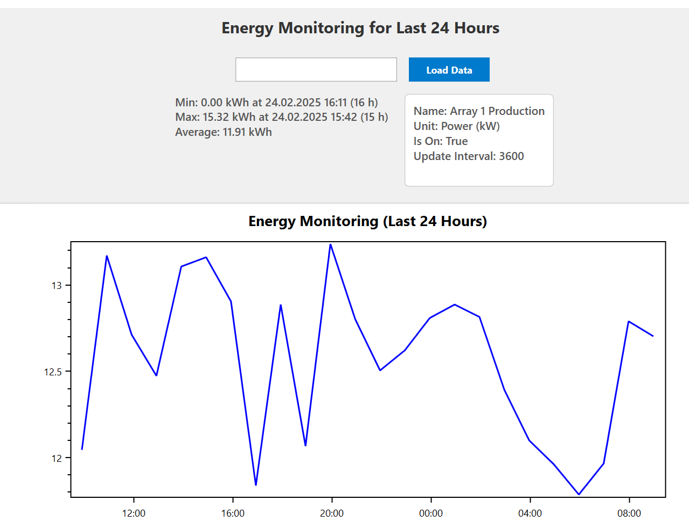
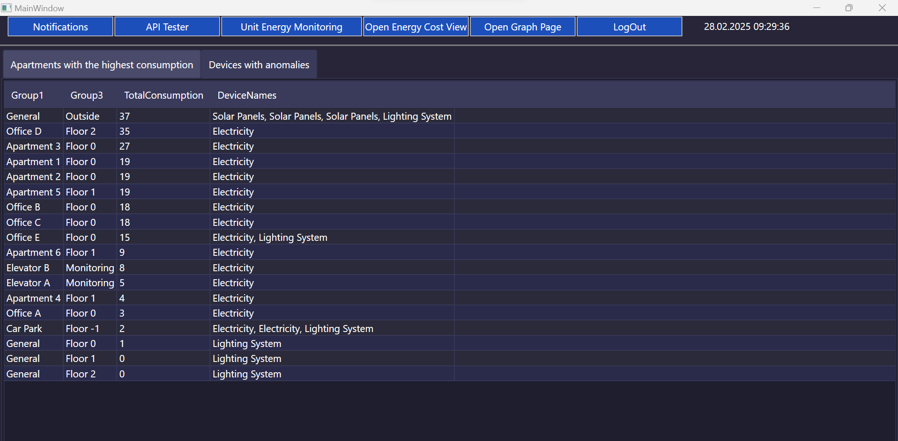
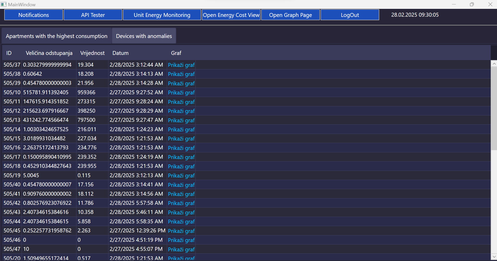
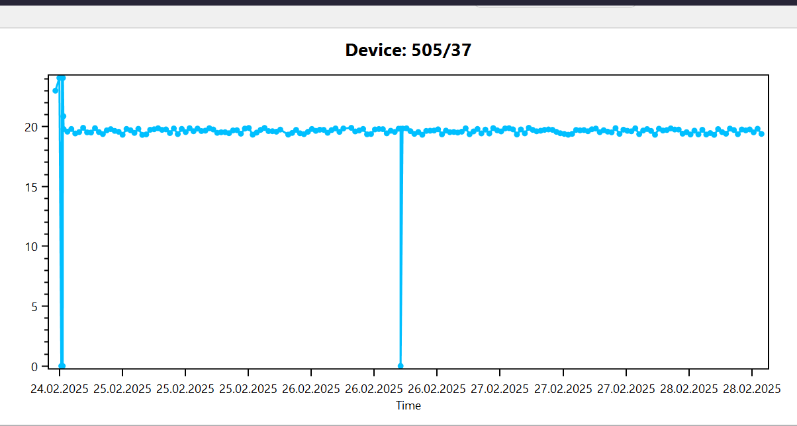
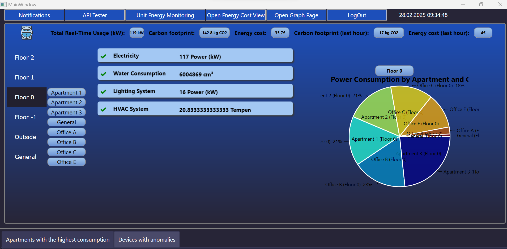
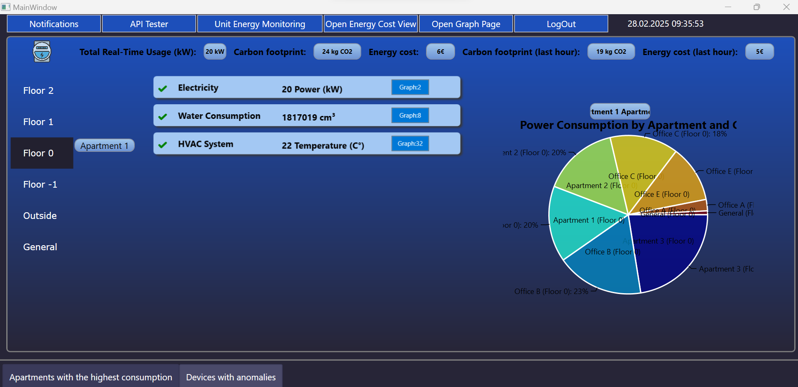
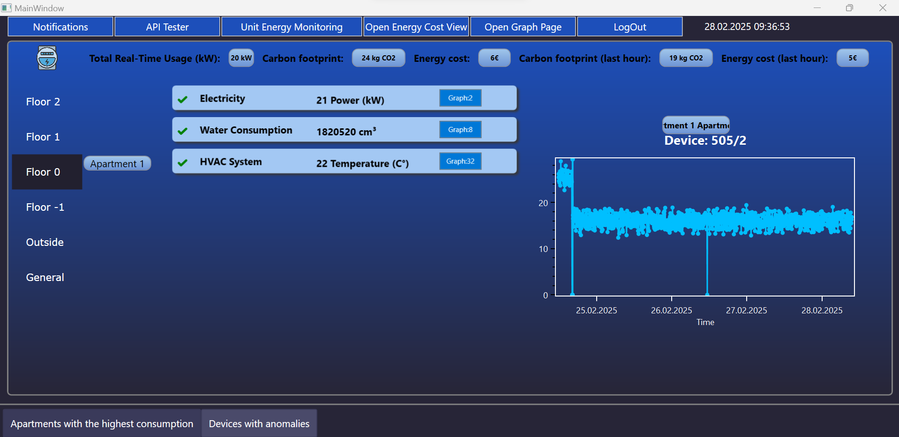
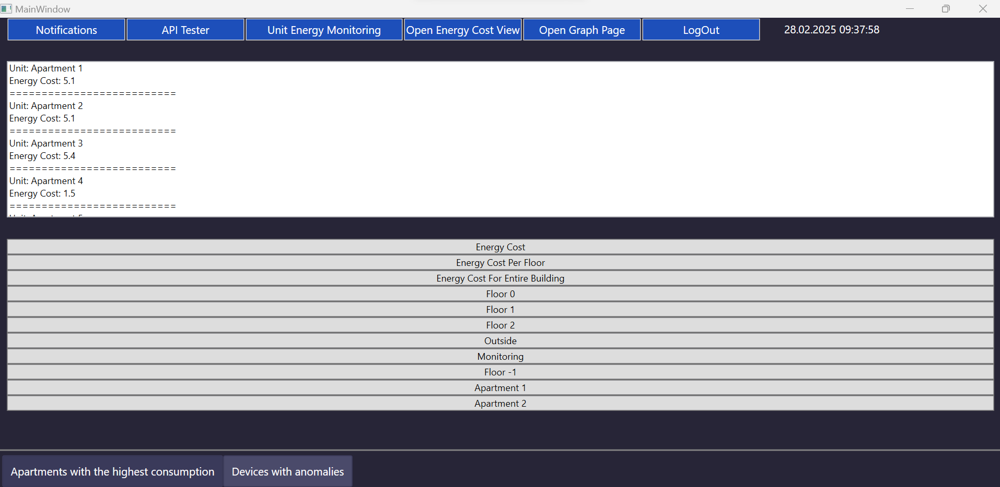
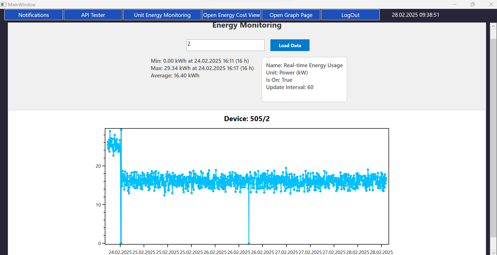

# Energy Monitoring and Management System

This repository contains the source code for an **Energy Monitoring and Management System** developed as part of the **Skyline Communications Coding Challenge** held from **February 24th to February 28th, 2025**. The application was built using **C# .NET Framework 4.8** and **WPF (Windows Presentation Foundation)**.

## Team Members
- **Amer Mujalo**
- **Kerim Imamovic**
- **Anes Cenanovic**
- **Safet Comor**

## Mentor
- **Alija Kusur** 
  
---

## Project Overview
The application is designed to provide building managers, residents, and maintenance teams with tools to monitor, manage, and optimize energy consumption in multi-unit buildings. The system addresses several key use cases to promote energy efficiency, cost transparency, and sustainability.

---

## Use Cases

### 1. **Unit-Level Energy Monitoring**
   - **Description**: Building managers and residents can track energy consumption for individual units or apartments.
   - **Purpose**: Identify high-usage areas and encourage energy-saving practices.

### 2. **Peak Energy Demand Management**
   - **Description**: Building administrators can monitor and manage energy demand during peak hours.
   - **Purpose**: Avoid excessive costs and reduce strain on local grids.

### 3. **Anomaly Detection in Energy Use**
   - **Description**: Maintenance teams receive alerts for abnormal energy usage patterns (e.g., sudden spikes due to faulty appliances or devices left running).
   - **Purpose**: Quickly investigate and resolve issues to prevent energy waste.

### 4. **Energy Cost Allocation**
   - **Description**: Property managers can allocate energy costs to each unit or apartment based on actual usage.
   - **Purpose**: Ensure transparency and accountability in energy billing.

### 5. **Sustainability Monitoring**
   - **Description**: Sustainability teams gain insights into the building's overall carbon footprint and receive recommendations for energy-saving initiatives (e.g., smart thermostats, better insulation).
   - **Purpose**: Promote sustainable practices and reduce environmental impact.

---

## Technologies Used
- **Programming Language**: C#
- **Framework**: .NET Framework 4.8
- **UI Framework**: WPF (Windows Presentation Foundation)
- **Development Environment**: Visual Studio

---

## Features
- **Real-Time Energy Monitoring**: Track energy consumption at the unit level in real-time.
- **Peak Demand Alerts**: Notify administrators of high energy usage during peak hours.
- **Anomaly Detection**: Automatically detect and alert maintenance teams of unusual energy patterns.
- **Cost Allocation Tools**: Generate fair and transparent energy bills for each unit.
- **Sustainability Insights**: Provide actionable recommendations to reduce the building's carbon footprint.

---

## How to Run the Application
1. **Prerequisites**:
   - Ensure you have the **.NET Framework 4.8** installed on your machine.
   - Download and install **Visual Studio** (if not already installed).

2. **Clone the Repository**:
   ```bash
   git clone https://github.com/amujalo1/OBEM-alphaTeam.git


## Project images

### User Login


### Notifications


### Energy Monitoring Last 24 Hours


### Devices with the highest Energy Consumption


### Devices with anomalies


### Anomaly Graph


### Unit Energy Monitoring Building


### Unit Energy Monitoring Building by floor


### Unit Energy Monitoring Building by certain space on floor


### Energy Cost View


### Graph Page By Device Id

